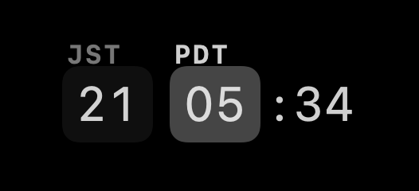
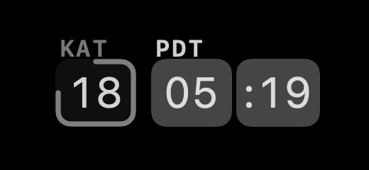

# Doubletime

A macOS menu bar clock that shows two time zones side by side.

  

One cell per zone, plus the primary minute. A thin ring on the secondary cell encodes the sub-hour offset, so half-hour zones like Kolkata read correctly.

  

The name and the itch both come from [One Clock](https://elaworkshop.github.io/oneclock).

## Features

- Any IANA time zone in either slot; the primary can follow the system zone.
- Labels up to five characters, derived from the zone or typed yourself.
- 12-hour or 24-hour digits; 12-hour mode tints each cell by its own AM or PM.
- Arc or segmented indicator.
- Optional blinking colon.
- Hover the clock to roll the trailing minute to the secondary zone's local time — only when the zones sit at a sub-hour offset (the arc/segment pairs).
- Settings previews rendered from the same raster as the real status item.

## Building

Open `doubletime.xcodeproj`, set your signing team, and run. Targets macOS 26.4; SwiftUI, no dependencies.
